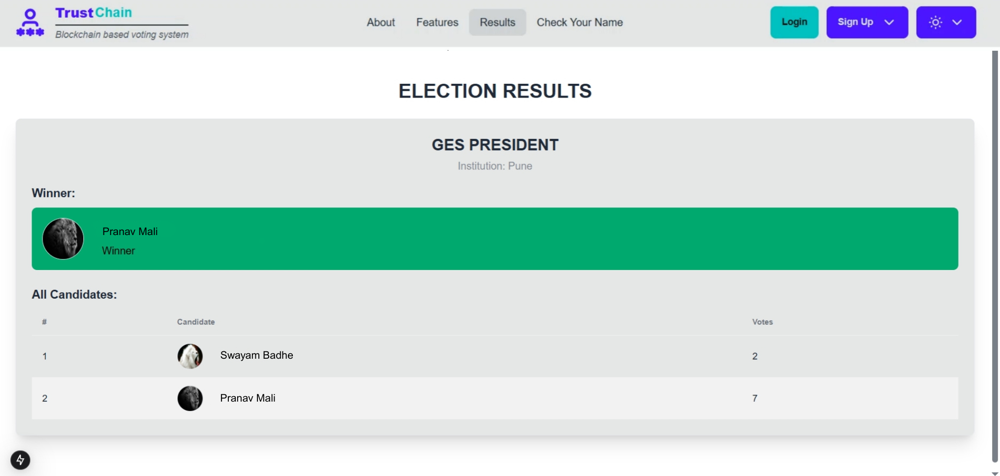
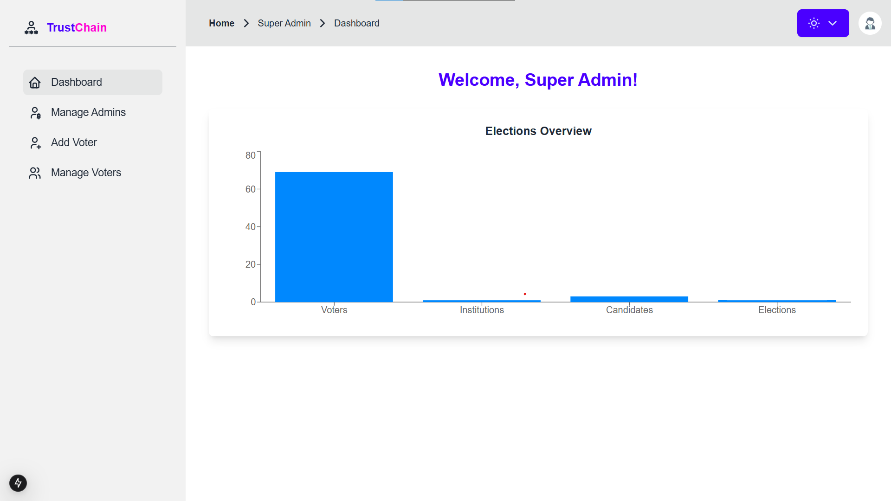

# Trustchain: Blockchain-Based Decentralized Voting Platform

A full-stack implementation of a secure, transparent, and tamper-proof voting system built on Ethereum blockchain technology.

## 🚀 Features

- **Tamper-Proof Voting:** Election logic enforced by immutable Ethereum smart contracts written in Solidity.
- **Secure Access Control:** Implemented special conditions in smart contracts to manage voter eligibility and platform permissions.
- **Complete Election Management:** Maintained a comprehensive database for voters, candidates, and election details.
- **Decentralized Integrity:** Leveraged blockchain transparency to ensure vote verification and prevent fraud.

## 🛠 Tech Stack

- **Blockchain:** Solidity, Ganache, Ethereum
- **Backend:** Node.js
- **Database:** MongoDB

## 📋 Project Overview

Developed a full-stack decentralized voting platform that demonstrates the practical application of blockchain for creating trustworthy digital elections. The system manages the entire election lifecycle while maintaining transparency and security through smart contracts.

This is a [Next.js](https://nextjs.org) project bootstrapped with [`create-next-app`](https://nextjs.org/docs/app/api-reference/cli/create-next-app).

## Getting Started

First, run the development server:

```bash
npm run dev
# or
yarn dev
# or
pnpm dev
# or
bun dev
```

Open [http://localhost:3000](http://localhost:3000) with your browser to see the result.

You can start editing the page by modifying `app/page.tsx`. The page auto-updates as you edit the file.

This project uses [`next/font`](https://nextjs.org/docs/app/building-your-application/optimizing/fonts) to automatically optimize and load [Geist](https://vercel.com/font), a new font family for Vercel.

## Learn More

To learn more about Next.js, take a look at the following resources:

- [Next.js Documentation](https://nextjs.org/docs) - learn about Next.js features and API.
- [Learn Next.js](https://nextjs.org/learn) - an interactive Next.js tutorial.

You can check out [the Next.js GitHub repository](https://github.com/vercel/next.js) - your feedback and contributions are welcome!

## Deploy on Vercel

The easiest way to deploy your Next.js app is to use the [Vercel Platform](https://vercel.com/new?utm_medium=default-template&filter=next.js&utm_source=create-next-app&utm_campaign=create-next-app-readme) from the creators of Next.js.

Check out our [Next.js deployment documentation](https://nextjs.org/docs/app/building-your-application/deploying) for more details.

## 📸 Project Screenshots

<div align="center">

### 🔐 Admin Login


### 🗳️ Cast Vote


### 🗃️ Database


### 🧮 Election Result


### 🗓️ Events-Ganach


### 🛠️ Start Election


### 🔓 Super Admin Login


### 📊 Super Admin Dashboard


### 📋 Transaction Details


### ✅ Verify Candidates


</div>

## 📜 License:
MIT
